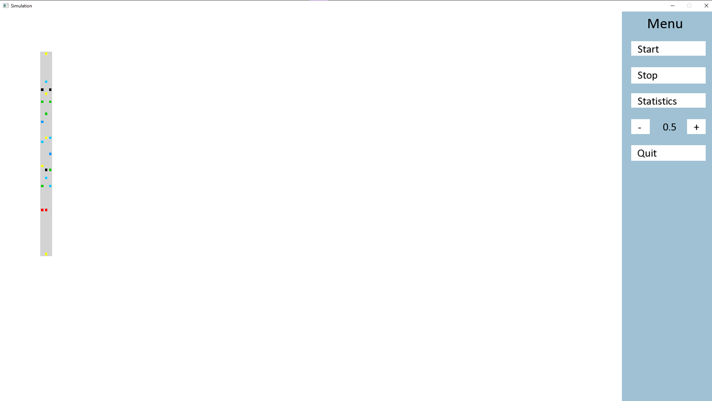
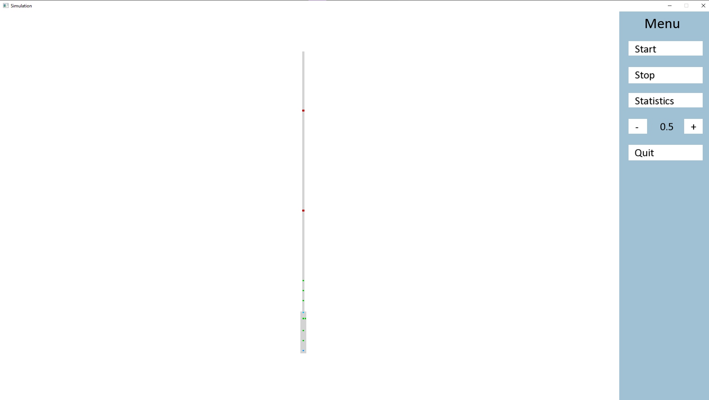
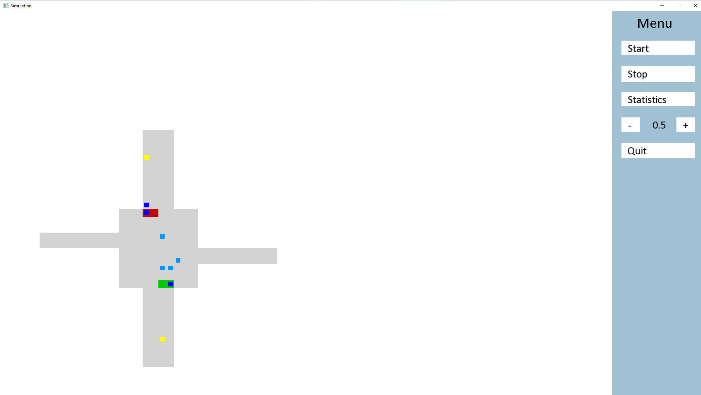
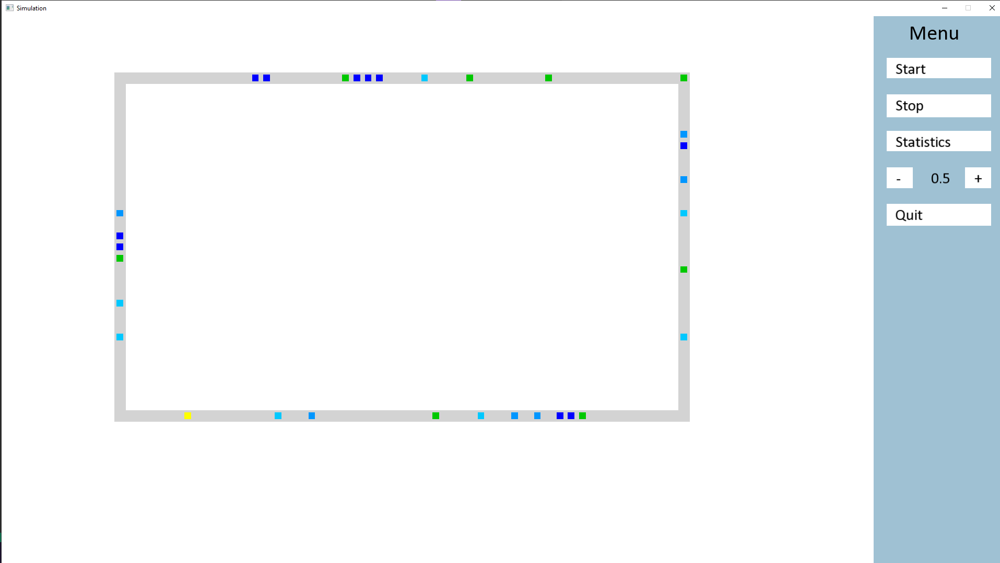

# Library for creating a traffic simulator 
Student project of a library in C++ used to create a road traffic simulator. 

# Authors
*Kacper Chrzanowski*  
*Weronika Drożdż*  
*Gabor Łukjaniuk*  
*Filip Stodolny*  
*Dominik Dzięgielewski*  
*Andrey Kmet*  

# Table of Contents
1. [Introduction](#introduction)
2. [Installation](#installation)
3. [Test codes for libraries](#test-codes-for-libraries)
4. [Test codes for program](#test-codes-for-program)
5. [Basic classes](#basic-classes)  
5.1. [BasicCrossingInput](#basiccrossinginput)  
5.2. [CarHolder](#carholder)  
5.3. [Cell](#cell)  
5.4. [Crossing](#crossing)  
5.5. [Generator](#generator)    
5.6. [LaneEndsMerge](#laneendsmerge)  
5.7. [Map](#map)    
5.8. [Observer](#observer)  
5.9. [Obstacle](#obstacle)  
5.10. [Road](#road)  
5.11. [RoadCell](#roadcell)  
5.12. [Simulation](#simulation)  
5.13. [SmartCrossingInput](#smartcrossinginput)  
5.14. [Statistics](#statistics)  
5.15. [TrafficLights](#trafficlights)  
5.16. [Vehicle](#vehicle)
6. [Models](#models)  
6.1 [BasicCrossing](#basiccrossing)  
6.2 [LaneEndsMergeL](#laneendsmergel)  
6.3 [LaneEndsMergeLR](#laneendsmergelr)  
6.4 [LaneEndsMergeR](#laneendsmerger)  
6.5 [SmartCrossing](#smartcrossing)    
6.6 [RGTrafficLights](#rgtrafficlights)  
6.7 [RGYTrafficLights](#rgytrafficlights)  
7. [GUI](#gui)  
7.1 [Localization](#localization)  
7.2 [SimulationWindow](#simulationwindow)   
8. [Demo pictures](#demo-pictures)
9. [Percentage of participation in tasks](#percentage-of-participation-in-tasks)  

# Introduction

# Installation
1. Download to selected folder [vcpkg](https://vcpkg.io/en/getting-started.html)  
2. Using Developer Command Prompt, go to vcpkg folder and install vcpkg.exe
```
.\bootstrap-vcpkg.bat
```
2. Install SFML 
```
.\vcpkg install sfml
```
3. Install Boost 
```
.\vcpkg.exe install boost:x64-windows boost:x86-windows
```
4. Install [Gnuplot](http://www.gnuplot.info/download.html) and adds it to environment variables / PATH
5. Use command
```
.\vcpkg.exe integrate install
```
6. Change C++ version to C++ 17, Debug/Release and x86 in VS Community
# Test codes for libraries
SFML
```
#include <SFML/Graphics.hpp>

int main()
{
    sf::RenderWindow window(sf::VideoMode(200, 200), "SFML works!");
    sf::CircleShape shape(100.f);
    shape.setFillColor(sf::Color::Green);

    while (window.isOpen())
    {
        sf::Event event;
        while (window.pollEvent(event))
        {
            if (event.type == sf::Event::Closed)
                window.close();
        }

        window.clear();
        window.draw(shape);
        window.display();
    }

    return 0;
}
```

Gnuplot

```
#include <vector>
#include <cmath>
#include <boost/tuple/tuple.hpp>

#include "gnuplot-iostream.h"

int main() {
	Gnuplot gp;
	// Create a script which can be manually fed into gnuplot later:
	//    Gnuplot gp(">script.gp");
	// Create script and also feed to gnuplot:
	//    Gnuplot gp("tee plot.gp | gnuplot -persist");
	// Or choose any of those options at runtime by setting the GNUPLOT_IOSTREAM_CMD
	// environment variable.

	// Gnuplot vectors (i.e. arrows) require four columns: (x,y,dx,dy)
	std::vector<boost::tuple<double, double, double, double> > pts_A;

	// You can also use a separate container for each column, like so:
	std::vector<double> pts_B_x;
	std::vector<double> pts_B_y;
	std::vector<double> pts_B_dx;
	std::vector<double> pts_B_dy;

	// You could also use:
	//   std::vector<std::vector<double> >
	//   boost::tuple of four std::vector's
	//   std::vector of std::tuple (if you have C++11)
	//   arma::mat (with the Armadillo library)
	//   blitz::Array<blitz::TinyVector<double, 4>, 1> (with the Blitz++ library)
	// ... or anything of that sort

	for (double alpha = 0; alpha < 1; alpha += 1.0 / 24.0) {
		double theta = alpha * 2.0 * 3.14159;
		pts_A.push_back(boost::make_tuple(
			cos(theta),
			sin(theta),
			-cos(theta) * 0.1,
			-sin(theta) * 0.1
		));

		pts_B_x.push_back(cos(theta) * 0.8);
		pts_B_y.push_back(sin(theta) * 0.8);
		pts_B_dx.push_back(sin(theta) * 0.1);
		pts_B_dy.push_back(-cos(theta) * 0.1);
	}

	// Don't forget to put "\n" at the end of each line!
	gp << "set xrange [-2:2]\nset yrange [-2:2]\n";
	// '-' means read from stdin.  The send1d() function sends data to gnuplot's stdin.
	gp << "plot '-' with vectors title 'pts_A', '-' with vectors title 'pts_B'\n";
	gp.send1d(pts_A);
	gp.send1d(boost::make_tuple(pts_B_x, pts_B_y, pts_B_dx, pts_B_dy));

#ifdef _WIN32
	// For Windows, prompt for a keystroke before the Gnuplot object goes out of scope so that
	// the gnuplot window doesn't get closed.
	std::cout << "Press enter to exit." << std::endl;
	std::cin.get();
#endif
}
```

# Test codes for program
Demo
```
#include "../Basic Classes/Simulation.h"
#include "../Models/RGTrafficLights.h"
#include "../Models/SmartCrossing.h"
#include "../Models/BasicCrossing.h"
#include "../Models/LaneEndsMergeL.h"
#include "../Models/LaneEndsMergeLR.h"
#include "../Models/LaneEndsMergeR.h"
#include "../Models/BasicCrossing.h"
#include "../Models/SmartCrossing.h"
#include "../Models/RGTrafficLights.h"
#include "../Models/RGYTrafficLights.h"


#define V 0
#if V == 0
int main() {
	std::srand(time(NULL));

	Map* map = new Map("test map");

	Road* road = new Road(150, 3, 3);
	road->fillWithVehs(0.2);
	road->addObstacle(50, 1);
	road->addObstacle(100, 0);
	road->addObstacle(100, 2);

	Generator* generator0 = new Generator(3, 0.2);
	Generator* generator1 = new Generator(3, 0.2);
	Generator* generator2 = new Generator(3, 0.2);

	linkCells(generator0, road->getLaneHead(0));
	linkCells(generator1, road->getLaneHead(1));
	linkCells(generator2, road->getLaneHead(2));

	map->addRoad(road);
	map->addGenerator(generator0);
	map->addGenerator(generator1);
	map->addGenerator(generator2);

	Simulation simulation = Simulation(map, 0.2, 0);
	simulation.initiateSimulation();

	for (int i = 0; i < 100; i++) {
		std::cout << "Iteration: " << i << std::endl;
		std::cout << simulation.toString() << std::endl;
		simulation.transitionFunc();
	}

	delete map;
}
#elif V == 1
int main() {
	std::srand(time(NULL));

	Map* map = new Map("test map");

	Road* road = new Road(50, 1, 5);

	Generator* generator0 = new Generator(5, 0.2);
	Generator* generator1 = new Generator(5, 0.2);
	Generator* generator2 = new Generator(5, 0.2);

	LaneEndsMergeLR* laneEndsMerge = new LaneEndsMergeLR(20, 1, 5);

	linkCells(generator0, laneEndsMerge->getEndingLaneLHead());
	linkCells(generator1, laneEndsMerge->getLaneHead(0));
	linkCells(generator2, laneEndsMerge->getEndingLaneRHead());

	linkCells(laneEndsMerge->getLaneTail(0), road->getLaneHead(0));

	RGTrafficLights* trafficLights = new RGTrafficLights(LightColor::green, 10, 10);

	road->addTrafficLightsToAllLanes(trafficLights, 25);

	map->addRoad(road);
	map->addGenerator(generator0);
	map->addGenerator(generator1);
	map->addGenerator(generator2);
	map->addLaneEndsMerge(laneEndsMerge);

	Simulation simulation = Simulation(map, 0.2, 0);
	simulation.initiateSimulation();

	for (int i = 0; i < 100; i++) {
		std::cout << "Iteration: " << i << std::endl;
		std::cout << simulation.toString() << std::endl;
		simulation.transitionFunc();
	}

	delete map;
}
#elif V == 2
int main() {
	std::srand(time(NULL));

	Map* map = new Map("test map");

	Road* road0 = new Road(10, 1, 4);
	Road* road1 = new Road(10, 1, 4);
	Road* road2 = new Road(10, 1, 4);
	Road* road3 = new Road(10, 1, 4);

	Generator* generator0 = new Generator(4, 0.5);
	Generator* generator1 = new Generator(4, 0.5);
	Generator* generator2 = new Generator(4, 0.5);
	Generator* generator3 = new Generator(4, 0.5);

	linkCells(generator0, road0->getLaneHead(0));
	linkCells(generator1, road1->getLaneHead(0));
	linkCells(generator2, road2->getLaneHead(0));
	linkCells(generator3, road3->getLaneHead(0));

	BasicCrossing* crossing = new BasicCrossing(8, 8, 4);

	crossing->addNewCrossingLane('N', 2, 'S', 2, 1);
	crossing->addNewCrossingLane('N', 2, 'W', 3, 2);
	crossing->addNewCrossingLane('N', 3, 'S', 3, 2);
	crossing->addNewCrossingLane('N', 3, 'E', 4, 1);

	crossing->addNewCrossingLane('S', 4, 'N', 4, 2);
	crossing->addNewCrossingLane('S', 4, 'W', 3, 1);
	crossing->addNewCrossingLane('S', 5, 'N', 5, 1);
	crossing->addNewCrossingLane('S', 5, 'E', 4, 2);

	crossing->linkCellToCrossingInput(road0->getLaneTail(0), 'N', 2);
	crossing->linkCellToCrossingInput(road1->getLaneTail(0), 'N', 3);
	crossing->linkCellToCrossingInput(road2->getLaneTail(0), 'S', 4);
	crossing->linkCellToCrossingInput(road3->getLaneTail(0), 'S', 5);

	RGTrafficLights* trafficLights0 = new RGTrafficLights(LightColor::green, 16, 10);
	RGTrafficLights* trafficLights1 = new RGTrafficLights(LightColor::green, 16, 10);
	RGTrafficLights* trafficLights2 = new RGTrafficLights(LightColor::red, 16, 10, 3);
	RGTrafficLights* trafficLights3 = new RGTrafficLights(LightColor::red, 16, 10, 3);

	crossing->addTrafficLights(trafficLights0, 'N', 2);
	crossing->addTrafficLights(trafficLights1, 'N', 3);
	crossing->addTrafficLights(trafficLights2, 'S', 4);
	crossing->addTrafficLights(trafficLights3, 'S', 5);

	map->addRoad(road0);
	map->addRoad(road1);
	map->addRoad(road2);
	map->addRoad(road3);
	map->addGenerator(generator0);
	map->addGenerator(generator1);
	map->addGenerator(generator2);
	map->addGenerator(generator3);
	map->addCrossing(crossing);

	Simulation simulation = Simulation(map, 0.2, 0);
	simulation.initiateSimulation();

	for (int i = 0; i < 100; i++) {
		std::cout << "Iteration: " << i << std::endl;
		std::cout << simulation.toString() << std::endl;
		simulation.transitionFunc();
	}

	delete map;
}
#endif
```

# Basic classes
## BasicCrossingInput
Filename with class: **BasicCrossingInput.h**  
Class name: **BasicCrossingInput**  

| Variable name	  | Variable type			                  | Description											                                          |
| -------------   |-                                    | -----------------------------------------------------------------         |
| nextCells       |std::vector<[Cell](#cell)*>          | variable that holds vector of pointers to [Cell][#cell] adjacent to top         |
| weights         |std::vector<int>                     | variable that holds vector to weights. Weights tells us about number of cars coming out of a Cell                                     |
| weightsSum      |int                                  | variable that holds sum of weights                                        |
| drawnLane       |int                                  | draws one of the lanes                                                    |

| Function type and name	| Arguments	| Description																		|
| ------------- | ------------- | ----------------------------------------------------- |
| BasicCrossingInput			| void | Class constructor																	|
| BasicCrossingInput			| int maxSpeed | Class constructor	|
| Cell* getNextCell | void | return pointer to next [Cell][#cell]															|
| void setNextCell | Cell* nextCell | sets next [Cell][#cell] without a weights |
| void setNextCell			| Cell* nextCell, int weight | sets next [Cell][#cell] with a given weights	|


## CarHolder
Filename with class: **CarHolder.h**  
Class name: **CarHolder**  

| Variable name	  | Variable type			        | Description											                                          |
| -------------   | -                                | -----------------------------------------------------------------         |
| vehicle         |[Vehicle](#vehicle)*             | variable that holds a pointer to [CarHolder][#carholder] adjacent to top  |

| Function type and name			                    | Arguments							                      | Description																				                                        |
| ----------------------------------------------------  | ---------------------------------	          | ----------------------------------------------------------------------------------------- |
| [CarHolder](#carholder)						        | ---------------------------------	          | Class constructor																			                                    |
| ~[CarHolder](#carholder)                              | ---------------------------------           | Class destructor
| void getVehicle					                    | ----------------------- | Function gets from current [CarHolder](#carholder) [Vehicle](#vehicle)					        |
| void setVehicle					                    | [Vehicle*](#vehicle) veh | Function sets in current [CarHolder](#carholder) new pointer to [Cell](#cell) adjacent to the right	|


## Cell
Filename with class: **Cell.h**  
Class name: **Cell**  

| Variable name	  | Variable type			              | Description											                                          |
| -------------   |-                                | -----------------------------------------------------------------         |
| carHolder       |[CarHolder](#carholder)*                       | variable that holds a pointer to [CarHolder][#carholder] adjacent to top  |
| rightCell		    |Cell*                            | variable that holds a pointer to [Cell](#cell) adjacent to right	        |
| leftCell		    |Cell*                            | variable that holds a pointer to [Cell](#cell) adjacent to left	          |
| previousCell	  |Cell*                            | variable that holds a pointer to [Cell](#cell) adjacent to top	          |
| maxSpeed	      |int                              |variable that holds a max speed in [Cell](#cell)	                          |
| trafficLight	  |[TrafficLights](#traffic-lights)*|variable that holds a pointer to [TrafficLights](#traffic-lights)          |
| isObstacleAhead | boolean                         | flag that informs is an obstacle ahead of current [Cell](#cell)           |

| Function type and name			                                | Arguments							                      | Description																				                                        |
| ---------------------------------                           | ---------------------------------	          | ----------------------------------------------------------------------------------------- |
| [Cell*](#cell)						                                  | ---------------------------------	          | Class constructor																			                                    |
| [Cell*](#cell)		                                          | int maxSpeed	                              | Class constructor																		                                    	|
| ~[Cell*](#cell)                                             | ---------------------------------           | Class destructor
| void setVehicle					                                    | [Vehicle*](#vehicle) vehicle		            | Function sets in current [Cell](#cell) new pointer to [Vehicle](#vehicle)					        |
| void setRightCell					                                  | [Cell*](#cell) newRightCell		              | Function sets in current [Cell](#cell) new pointer to [Cell](#cell) adjacent to the right	|
| void setLeftCell					                                  | [Cell*](#cell) newLeftCell		              | Function sets in current [Cell](#cell) new pointer to [Cell](#cell) adjacent to the left	|
| void setPreviousCell			      	                          | [Cell*](#cell) newPreviousCell	            | Function sets in current [Cell](#cell) new pointer to  [Cell](#cell) adjacent to bottom	  |
| virtual void setNextCell					                          | [Cell*](#cell) newNextCell		              | Function sets in current [Cell](#cell) new pointer to [Cell](#cell) adjacent to top		    |
| [Vehicle*](#vehicle)  getVehicle	                          | ---------------------------------	          | Function returns pointer to [Vehicle](#vehicle) in current cell							              |
| void setCarHolder                                           | [CarHolder*](#carholder) carHolder          | Function sets in current [Cell](#cell) new pointer to [CarHolder](#carholder)             |
| [Cell*](#cell)  getRightCell		                            | ---------------------------------	          | Function returns pointer to [Cell](#cell) adjacent to right							                	|
| [Cell*](#cell)  getLeftCell		                              | ---------------------------------	          | Function returns pointer to [Cell](#cell) adjacent to left								                |
| [Cell*](#cell)  getPreviousCell	                            | ---------------------------------	          | Function returns pointer to [Cell](#cell) adjacent to bottom								              |
| virtual [Cell*](#cell)  getNextCell		                      | ---------------------------------	          | Function returns pointer to [Cell](#cell) adjacent to top									                |
| void setMaxSpeed	                                          | int maxSpeed	                              | Function sets max speed in [Cell](#cell)							                                    |
| void getMaxSpeed	                                          | ---------------------------------	          | Function returns max speed in [Cell](#cell)			                                          |
| void createJSON	                                            | ---------------------------------	          | Function creates JSON data tree of current [Cell](#cell)                                  |
| [TrafficLights](#traffic-lights)* getTrafficLight	          | ---------------------------------	          | Function return pointer to  [TrafficLights](#traffic-lights) if present in [Cell](#cell)  |
| void setTrafficLight	                                      | [TrafficLights](#traffic-lights)* newLight	| Function sets pointer to [TrafficLights](#traffic-lights)                                 |
| bool getObstacleAhead                                       | ---------------------------------           | Function returns flag which informs about an obstacle ahead of current [Cell](#cell)      |
| void setObstacleAhead                                       | bool isObstacleAhead                        | Function sets flag which informs about an obstacle ahead of current [Cell](#cell)         |


## Crossing
Filename with class: **Crossing.h**  
Class name: **Crossing**  

| Variable name | Variable type	| Description											|
| ------------- | ------------- | ----------------------------------------------------- |
| name			| string		| variable that holds a [Generator](#generator) name	|
| ID  | int | variable that holds ID of [Generator](#generator) |
| IDcnt			| int static			| variable that holds a [Generator](#generator) ID for a new create vehicle	|
| crossingHeight | int | variable that holds crossing height (in [Cells](*cell))
| crossingLength | int | variable that holds crossing length (in [Cells](*cell))
| crossingMaxSpeed | int | variable that holds crossing max speed
| carHolderMatrix | vector<vector<[CarHolder*](#carholder)>> | matrix of [CarHolders](#carholder) building [Crossing](#crossing)
| outputN | vector<[RoadCell*](#roadcell)> | vector that holds [RoadCells](#roadcell) in north output of [Crossing](#crossing)
| outputE | vector<[RoadCell*](#roadcell)> | vector that holds [RoadCells](#roadcell) in east output of [Crossing](#crossing)
| outputS | vector<[RoadCell*](#roadcell)> | vector that holds [RoadCells](#roadcell) in south output of [Crossing](#crossing)
| outputW | vector<[RoadCell*](#roadcell)> | vector that holds [RoadCells](#roadcell) in west output of [Crossing](#crossing)
| crossingLanes | vector<vector<[RoadCell*](#roadcell)>> | list of lists of [RoadCells](#roadcell) building [Crossing](#crossing)
| trafficLights | vector<[TrafficLights*](#trafficlights)> | vector that holds [TrafficLights](#trafficlights) of [Crossing](#crossing)

| Function type and name	| Arguments	| Description																		|
| ------------- | ------------- | ----------------------------------------------------- |
| Crossing		| string name, int crossingHeight, int crossingLength, int crossingMaxSpeed | Class constructor																	|
| Crossing			| int crossingHeight, int crossingLength, int crossingMaxSpeed | Class constructor	|
| ~Crossing | -----------------------------------------------------  | Class destructor																|
| int getID | -----------------------------------------------------  | Function returns ID of current [Crossing](#crossing) |
| string getName			| ------------------------- | Function returns name of current [Crossing](#crossing)		|
| virtual void addNewCrossingLane | char inputSide, int inputIndex, char outputSide, int outputIndex, int laneWeight | Function adds new [Crossing](#crossing) lane
| virtual void linkRoadLaneToCrossing | [Cell*](#cell) previousCell, char inputSide, int inputIndex | Function links last [Cell](#cell) of [Road](#road) to [Crossing](#crossing)
| void linkRoadLaneToCrossing | char outputSide, int outputIndex, [Cell*](#cell) nextCell | Function links output of [Crossing](#crossing) to first [Cell](#cell) of [Road](#road)
| virtual void updateCrossing | ----------------------------------------- | Function updates all objects in [Crossing](#crossing)
| virtual void addTrafficLights | [TrafficLights*](#trafficlights) newLight, char inputSide, int inputIndex | Function adds new [TrafficLights](#trafficlights) to [Crossing](#crossing)
| string toString | --- | Function returns string which represents current [Crossing](#crossing) |


## Generator
Filename with class: **Generator.h**  
Class name: **Generator**  

Inherits from: [Cell](#cell)

| Variable name | Variable type	| Description											|
| ------------- | ------------- | ----------------------------------------------------- |
| name			| string		| variable that holds a [Generator](#generator) name	|
| ID  | int | variable that holds ID of [Generator](#generator) |
| IDcnt			| int static			| variable that holds a [Generator](#generator) ID for a new create vehicle	|
| createVehProb | double | variable that holds a probability of creating [Vehicle](#vehicle) every iteration | 

| Function type and name	| Arguments	| Description																		|
| ------------- | ------------- | ----------------------------------------------------- |
| Generator			| string name, int maxSpeed, double createVehProb | Class constructor																	|
| Generator			| int maxSpeed, double createVehProb | Class constructor	|
| ~Generator | --- | Class destructor																|
| int getID | --- | Function returns ID of current [Generator](#generator) |
| string getName			| ------------------------- | Function returns name of current [Generator](#generator)		|
| void createVeh				| --------- | Function creates new [Vehicle](#vehicle) inside current [Generator](#generator)	|
| string toString | --- | Function returns string which represents current [Generator](#generator) |


## LaneEndsMerge
Filename with class: **LaneEndsMerge.h**  
Class name: **LaneEndsMerge**  

| Variable name	  | Variable type			                                    | Description											                                          |
| -------------   |-                                                      | -----------------------------------------------------------------         |
| IDcnt           | static int                                             | variable that holds a pointer to [CarHolder][#carholder] adjacent to top  |
| ID		          | int                                                    | variable that holds a pointer to [Cell](#cell) adjacent to right	        |
| maxSpeed		    | int                                                    | variable that holds a pointer to [Cell](#cell) adjacent to left	          |
| length	        | int                                                    | variable that holds a pointer to [Cell](#cell) adjacent to top	          |
| height	        | int                                                    |variable that holds a max speed in [Cell](#cell)	                          |
| name	          | std::string                                            |variable that holds a pointer to [TrafficLights](#traffic-lights)          |
| lanes           | std::vector<std::vector<Cell*>>                       | flag that informs is an obstacle ahead of current [Cell](#cell)           |


| Function type and name	                                    | Arguments                                                         	| Description																		    |
| -------------                                               | -------------                                                       | ------------------------------------------------- |
| LaneEndsMerge		                                            | std::string name, int length, int height, int roadMaxSpeed          | Class constructor																	|
| LaneEndsMerge		                                            | int length, int height, int roadMaxSpeed                    				|                                                   |
| ~LaneEndsMerge		                                          | void                                                                | Class constructor																  |
| int getID			                                              | void                                                                | Class constructor	                                |
| std::string getNamel                                        | void | return pointer to next [Cell][#cell]													|                                                   |  
| int getMaxSpeed                                             | Cell* nextCell | sets next [Cell][#cell] without a weights          |                                                   |
| Cell* getLaneHead			                                      | int lane | sets next [Cell][#cell] with a given weights	            |                                                   |
| Cell* getLaneTail	                                        	| int lane | Class constructor																	      |                                                   |
| std::vector<std::vector<Cell*>> getLanes()	                | void | Class constructor																	          |                                                   |
| virtual std::vector<std::vector<Cell*>> getEndingLanes()		| void | Class constructor																	          |                                                   |
| virtual int getPassableCellsCnt()                         	| void | Class constructor																          	|                                                   |
| virtual std::vector<Cell*> getCellsWithVehs()	              | void | Class constructor																	          |                                                   |
| virtual void fillWithVehs(double fillingDegree) 		        | void | Class constructor																	          |                                                   |
| virtual std::string toString()	                            | void | Class constructor																	          |                                                   |


## Map
Filename with class: **Map.h**  
Class name: **Map**  

| Variable name  | Variable type						                	| Description																                                |
| -------------  | -------------------------------------      | ------------------------------------------------------------------------- |
| name			     | string								                      | variable that holds a [Map](#map) name									                  |
| roads			     | map<[Road](#road), int>				            | variable that holds a map of [Roads](#road)								                |
| generators	   | map<[Generator](#generator), int>		      | variable that holds a map of [Generators](#generator)					          	|
| crossings      | vector<[Crossing*](#crossing)>             | vector that holds [Crossings](#crossings)                                 |
| laneEndsMerges | vector<[LaneEndsMerge*](#lane-ends-merge)> | vector that holds [LaneEndsMerge](#lane-ends-merge)                       |

| Function type and name	| Arguments		| Description												|
| ------------------------- | ------------- | --------------------------------------------------------- |
| [Map](#map)					| string name	| Class constructor	|
| ~[Map](#map)    | --- | Class destructor
| void addRoad					| [Road*](#road) road	| Function adds road to [Map](#map)	|
| void addGenerator					| Generator* generator	| Function adds generator to [Map](#map)	|
| void addCrossing | [Crossing*](#crossing) | Function adds [Crossing](#crossing) to [Map](#map) |
| void addLaneEndsMerge | [LaneEndsMerge*](#lane-ends-merge) laneEndsMerge | Function adds [LaneEndsMerge] to [Map](#map)
| void updateMap | vector<[Cell*](#cell)>* cellsWithVehs | Function updates [Map](#map) vector of [Cells](#cell)
| vector<[Crossing*](#crossing) getCrossings | --- | Function returns vector of [Crossings](#crossing)
| vector<[LaneEndsMerge*](#lane-ends-merge)> | --- | Function returns vector of [LaneEndsMerge](#lane-ends-merge) |
| vector<Road*> getRoads				|  -------------------------------------------------- 	| Function returns vector [Roads](#road)	|
| int getMapPassableCellsCnt | --- | Function returns number of passable [Cells](#cell) of current [Map](#map)
| void fillWithVehs                                           | double fillingDegree                                                        | Function fills [Road](#Road) with given filling degree between 0 and 1                      |
| vector<Generator*> getGenerators				|  -------------------------------------------------- 	| Function returns vector [Generators](#generator)	|
| vector<Cell*> getCellsWithVehs			|  -------------------------------------------------- 	| Function returns [Cells](#cell) with [Vechicles](#vehicle)	|
| string getName			|  -------------------------------------------------- 	| Function returns name of [Map](#map)	|
| void createJSON			| -------------------------------------------------- | Function creates JSON data tree of current [Map](#map)		|
| string toString                                             | --------------------------------------------------                          | Function returns string which represents current [Map](#map) 


## Observer
Filename with class: **Obserer.h**  
Class name: **Observer**

| Variable name	            | Variable type			              | Description											                                          |
| -------------             |-                                | -----------------------------------------------------------------         |
| IDcnt;                    |int static                       |  -----------------------------------------------------------------|
| name;		                  |std::string                      | -----------------------------------------------------------------	        |
| ID;		                    |int                              | -----------------------------------------------------------------	          |
| observationOriginCell;	  |Cell*                            |----------------------------------------------------------------- 	          |
| lastObservedVeh;	        |Vehicle*                         |-------------------------                       |
| observedPassingVehsCnt;	  |int                              | -----------------------------------------------------------------         |
| distToSearch;             | int                             | -----------------------------------------------------------------           |


| Function type and name	                | Arguments					                            | Description												|
| -------------------------               | -------------------------                     | --------------------------------- |
| Observer				                        | std::string name, Cell* observationOriginCell	| 										              |
| Observer				                        | Cell* observationOriginCell	                  | 									                |
| string getName			                    | -------------------------                     | (#vehicle)		                    |
| int getObservedPassingVehsCnt()					| -------------------------                     |		                                |
| void checkVehPassing()				          | -------------------------                     | Function returns s	              |
| std::string toString()				          | int speed					                            | 	                                |


## Obstacle
Filename with class: **Obstacle.h**  
Class name: **Obstacle**  

| Function type and name	                | Arguments					                            | Description												|
| -------------------------               | -------------------------                     | --------------------------------- |
| Obstacle				                          |  ------------------------- 	                  | 										              |

## Road
Filename with class: **Road.h**  
Class name: **Road**  

| Variable name       | Variable type			                                      | Description                               																         |
| -------------       | -----------------------------                           | -------------------------------------------------------------------------          |
| ID		              | int					                                            | variable that holds a [Road](#road) ID		                  							         |
| maxSpeed		        | int					                                            | variable that holds max vehicle speed										                           |
| length              | int                                                     | variable that holds road length                                                    |
| height              | int                                                     | variable that holds road height                                                    |
| name			          | string				                                          | variable that holds a [Road](#road) name									                         |
| lanes			          | vector<vector<[Cell](#cell)>>	                          | variable that holds vector of [Cells](#cell) creating up the road		    	         |
| trafficLights			  | vector<[TrafficLights]*(#traffic-lights)>	              | variable that holds vector of [Traffic Lights](#traffic-lights) set up on the road |
                    
| Function type and name	                                    | Arguments					                                                          | Description												                                                          |
| -------------------------                                   | --------------------------------------------------                          | ----------------------------------------------------------------------                      | 
| [Road](#Road)				                                        | string name, int length, int height, int maxSpeed                           | Class constructor									 	                                                        |
| [Road](#Road)				                                        | int length, int height, int maxSpeed                                        | Class constructor									 	                                                        |
| ~[Road](#Road)                                              | ---                                                                         | Class destructor									 	                                                        |
| [Cell*](#cell) getLaneHead                                  | int lane                                                                    | Function returns pointer to lane head                                                       |
| [Cell*](#cell) getLaneTail                                  | int lane                                                                    | Function returns pointer to lane tail                                                       |
| void setMaxSpeed		                                        | int maxSpeed				                                                        | Function sets new max speed in current [Road](#Road)		                                    |
| void setName				                                        | string name				                                                          | Function sets name in current [Road](#Road)				                                          |
| int getMaxSpeed			                                        | --------------------------------------------------                          | Function returns max speed of current [Road](#Road)		                                      | 
| int getID			                                              | --------------------------------------------------                          | Function returns ID of current [Road](#Road)	                                              |
| string getName			                                        | --------------------------------------------------                          | Function returns name of current [Road](#Road)			                                        |
| vector<[Cell*](#cell)> getCellsWithVehs                     | ---                                                                         | Function returns vector of pointers to [Cells*](#cell) which contains a [Vehicle](#vehicle) |
| int getLength			                                          | --------------------------------------------------                          | Function returns length of current [Road](#Road)			                                      |
| int getHeight		                                            | --------------------------------------------------                          | Function returns height of current [Road](#Road)			                                      |
| vector<vector<[Cell*](#cell)>> getLanes                     | --------------------------------------------------                          | Function returns lanes of current [Road](#road)                                             |
| int getPassableCellsCnt()                                   | --------------------------------------------------                          | Function return number of passable [Cells](#cell) of current [Road](#road)                  |
| void createJSON			                                        | --------------------------------------------------                          | Function creates JSON data tree of current [Road](#Road)	                                  |
| string tempToString			                                    | -------------------------                                                   | Function return [Road](#Road) as string                                                     |
| void addTrafficLightsToOneLane                              | [TrafficLights*](#traffic-lights) newLight, int distanceFromHead, int lane  | Function adds new [TrafficLights] to one selected [Road](#Road)                             |
| void addTrafficLightsToAllLanes                             | [TrafficLights*](#traffic-lights) newLight, int distanceFromHead            | Function adds new [TrafficLights] to all [Roads](#Road)                                     |
| void addObstacle                                            | int distanceFromHead, int lane, int spotDistance = 0                        | Function adds new obstacle in selected [Road](#Road)                                        |
| void fillWithVehs                                           | double fillingDegree                                                        | Function fills [Road](#Road) with given filling degree between 0 and 1                      |
| vector<[TrafficLights*](#traffic-lights)> getTraficLights		| ---                                                                         | Function returns vector of lights on the [Road](#Road)                                      |
| string toString                                             | --------------------------------------------------                          | Function returns string which represents current [Road](#Road)                                      |


Example code
```
#include "Basic Classes/Road.h"
#include "Basic Classes/Map.h"

int main() {
	Road* road = new Road(100, 1, 5);
	Map* map = new Map("example map");
	map->addRoad(road);
	return 0;
}
```
## RoadCell
Filename with class: **RoadCell.h**  
Class name: **RoadCell**  

 Variable name	            | Variable type			              | Description											                                          |
| -------------             |-                                | -----------------------------------------------------------------         |
| nextCell;                 |Cell*                            |  -----------------------------------------------------------------|

| Function type and name	                | Arguments					                            | Description												|
| -------------------------               | -------------------------                     | --------------------------------- |
| RoadCell				                        | -------------------------                     |
| RoadCell				                        | int maxSpeed                                  | 									                |
| ~RoadCell				                        | -------------------------                     |		                                |
| Cell* getNextCell				                | -------------------------                     | Function returns s	              |
| void setNextCell				                | Cell* nextCell					                      | 	                                |


## Simulation
Filename with class: **Simulation.h**  
Class name: **Simulation**  

| Variable name | Variable type	| Description														|
| ------------- | ------------- | ----------------------------------------------------------------- |
| cellsWithVehs | vector<[Cell*](#cell)> | vector that holds [Cells](#cell) with [Vehicles](#vehicle) |
| randEventProb	| double		| variable that holds random event									|
| simMap		| [Map*](#map)	| object that holds simulation of [map](#map)								|
|	simStats | [Statistics*](#statistics) | object that holds [Statistics](#statistics) of [Simulation](#simulation) |
|	observers | vector<[Observer*](#observer)> | vector that holds [Observers](#observer) | 
|	seed | int | variable that holds seed for randomEngine if given |
|	randomEngine | default_random_engine | variable that holds random engine for shuffling vector of [Vehicles](#vehicle) | 
|	minSafeSpace | int | variable that holds minimal distance between two [Vehicles](#vehicles) while changing lane of [Road](#road) |
|	shuffleIfCompetition | bool | variable that holds a flag for shuffling vector of [Vehicles](#vehicle) |

| Function type and name			| Arguments							| Description												|
| --------------------------------- | --------------------------------- | --------------------------------------------------------- |
| [Simulation](#simulation)					| [Map*](#map) simMap, double randEventProb, int minSafeSpace, int seed = NULL, bool shuffleIfCompetition = true | Class constructor											|
| [Map](#map) getSimulationMap | --- | Function returns [Simulation](#simulation) [Map](#map) |
| [Statistics*](#statistics) getSimulationStatistics | --- | Function returns [Statistics](#statistics) of [Simulation](#simulation) |
| [Observer*](#observer) getSimulationObserver | --- | Function returns [Observer](#observer) of [Simulation](#simulation) |
| void addObserver | [Observer*](#observer) observer | Function sets [Simulation](#simulation) [Observer](#observer) |
| void transitionFunc				| --------------------------------- | Function returns new position to [Vehicle](#vehicle) in next tick|
| void saveStatisticsToFile | string outFolder = "StatisticsHistory/" | Function saves [Statistics*](#statistics) to file in selected folder |
| void initiateSimulation | --- | Function starts [Simulation](#simulation) |
| string toString				| --------------------------------- | Function returns string which represents current [Simulation](#simulation)|


## SmartCrossingInput
Filename with class: **SmartCrossingInput.h**  
Class name: **SmartCrossingInput**  

 Variable name	            | Variable type			     | Description										         |
| -------------             |-                       | ----------------------                  |
| maxSpeedReminder          |int                     |  ---------------------------------------|
| drawnLaneReminder         |int                     |  ---------------------------------------|
| destinationCells          |std::vector<Cell*>      |  ---------------------------------------|

| Function type and name	            | Arguments					              | Description												|
| -------------------------           | -------------------------       | --------------------------------- |
| SmartCrossingInput				          | int maxSpeed                    |
| void setNextCell				            | Cell* nextCell                  | 									                |
| void setNextCell				            | Cell* nextCell, int weight      |		                                |
| void addDestinatinCell				      | Cell* destinationCell           | Function returns s	              |
| void drawLane				                |-------------------------				| 	                                |
| void checkCrossingEntryAvailability	|int laneIndex					          | 	                                |


## Statistics
Filename with class: **Statistics.h**  
Class name: **Statistics** 

| Variable name	  | Variable type			                  | Description											                                          |
| -------------   |-                                    | -----------------------------------------------------------------         |
| simRandEventProb       |double          | variable that holds probability of random events
| simMapPassableCellsCnt         |std::vector<int>                     | variable that holds vector to weights. Weights tells us about number of cars coming out of a Cell                                     |
| vehcCntSum      |int                                  | variable that holds sum of weights                                        |
| vehsSpeedsSum       |int                                  | draws one of the lanes                                                    |
| iterationCnt | int | variable that counts iterations of [Simulation](#simulation)
| simInitiationTime | string | variable that holds time of initiation of [Simulation](#simulation)

| Function type and name	| Arguments	| Description																		|
| ------------- | ------------- | ----------------------------------------------------- |
| Statistics			| -------------- | Class constructor																	|
| double getDensity			| ------------- | Function that returns density of [Vehicles](#vehicle) in [Simulation](#simulation)
| string getSimInitiationTime | -------------  | Function that returns initiation time of [Simulation](#simulation)														|
| void updateStatistics | std::vector<Cell*> cellsWithVehs | Function that updates [Statistics](#statistics) using vector of [Cells](#cells) with [Vehicles](#vehicle)
| std::string toString			| ------------- | Function returns string which represents current [Statistics](#statistics)	|


## TrafficLights
Filename with class: **TrafficLights.h**  
Class name: **TrafficLights** 

 Variable name	 | Variable type	 | Description										         |
| -------------  |-                | ----------------------                  |
| IDcnt          |int static       |  ---------------------------------------|
| ID             |int              |  ---------------------------------------|
| color          |LightColor       |  ---------------------------------------|
| redDuration    |int              |  ---------------------------------------|
| greenDuration  |int              |  ---------------------------------------|
| timer          |int              |  ---------------------------------------|
| name           |std::string      |  ---------------------------------------|


| Function type and name	            | Arguments					              | Description												|
| -------------------------           | -------------------------       | --------------------------------- |
| void create				                  | int timerOffset                    |
| TrafficLights				                | std::string name, LightColor startColor, int redDuration, int greenDuration, int timerOffset = 0                 | 									                |
| TrafficLights				                | LightColor startColor, int redDuration, int greenDuration, int timerOffset = 0      |		                                |
| int getID				                    | Cell* destinationCell           | Function returns s	              |
| std::string getName				          |-------------------------				| 	                                |
| int getGreenDuration	              |int laneIndex					          | 	                                |
| int getRedDuration	                |int laneIndex					          | 	                                |
| LightColor getColor	                |int laneIndex					          | 	                                |
| int getTimer	                      |int laneIndex					          | 	                                |
| virtual void updateTrafficLights()	|int laneIndex					          | 	                                |


## Vehicle
Filename with class: **Vehicle.h**  
Class name: **Vehicle**  

| Variable name | Variable type	| Description										|
| ------------- | ------------- | ------------------------------------------------- |
| name			| string		| variable that holds a [Vehicle](#vehicle) name	|
| ID			| int			| variable that holds a [Vehicle](#vehicle) ID		|
| speed			| int			| variable that holds a [Vehicle](#vehicle) speed	|
| IDcnt			| int static			| variable that holds a [Vehicle](#vehicle) ID for a new create vehicle	|
| isObstacle			| bool			| variable that holds if [Vehicle](#vehicle) is movement vehicle or obstacle	|

| Function type and name	| Arguments					| Description												|
| ------------------------- | ------------------------- | --------------------------------------------------------- |
| void Vehicle				| string name, int speed, bool isObstacle	| Class constructor											|
| void Vehicle				| int speed, bool isObstacle	| Class constructor											|
| string getName			| ------------------------- | Function returns name of current [Vehicle](#vehicle)		|
| int getID					| ------------------------- | Function returns ID of current [Vehicle](#vehicle)		|
| int getSpeed				| ------------------------- | Function returns speed of current [Vehicle](#vehicle)		|
| void setSpeed				| int speed					| Function sets new speed of current [Vehicle](#vehicle)	|
| bool checkIsObstacle				| -------------------------	| Function returns if [Vehicle](#vehicle) is obstacle	|
| void createJSON		| -------------------------	| Function creates JSON data tree of current [Vehicle](#vehicle)	|


# Models
## BasicCrossing
Filename with class: **BasicCrossing.h**  
Class names: **BasicCrossing**  
Inherits from: [Crossing](#crossing)  

| Variable name			| Variable type							| Description|
| --------------------------------- | --------------------------------- | --------------------------------------------------------- |
| inputN | vector<[BasicCrossingInput](#basiccrossinginput)> | Vector that holds north inputs of [BasicCrossingInputs](#basiccrossinginput) |
| inputE | vector<[BasicCrossingInput](#basiccrossinginput)> | Vector that holds east inputs of [BasicCrossingInputs](#basiccrossinginput) |
| inputS | vector<[BasicCrossingInput](#basiccrossinginput)> | Vector that holds south inputs of [BasicCrossingInputs](#basiccrossinginput)
| inputW | vector<[BasicCrossingInput](#basiccrossinginput)> | Vector that holds west inputs of [BasicCrossingInputs](#basiccrossinginput)

| Function type and name			| Arguments						| Description|
| --------------------------------- | --------------------------------- | --------------------------------------------------------- |
| BasicCrossing | int crossingHeight, int crossingLength, int crossingMaxSpeed | Class constructor
| ~BasicCrossing |- | Class destructor
| void addNewCrossingLane |char inputSide, int inputIndex, char outputSide, int outputIndex, int laneWeight| Function adds new lane to [BasicCrossing](#basiccrossing)|
| void linkRoadLaneToCrossing |Cell* previousCell, char inputSide, int inputIndex| Function links [Road](#road) to [BasicCrossing](#basiccrossing) by last [Road](#road) cell |
| void updateCrossing |-| Function updates [BasicCrossing](#basiccrossing) state |
| void addTrafficLights |TrafficLights* newLight, char inputSide, int inputIndex| Function adds [TrafficLights*](#trafficlights) to [BasicCrossing](#basiccrossing) |
| void checkParametersAreCorrect | char inputSide, int inputIndex, char outputSide, int outputIndex| Function validates parameters |


## LaneEndsMergeL
Filename with class: **LaneEndsMergeL.h**  
Class names: **LaneEndsMergeL**  

| Variable name			| Variable type							| Description|
| --------------------------------- | --------------------------------- | --------------------------------------------------------- |
| endingLaneL | vector<[Cell*](#cell) | Vector that holds [Cells](#cell)

| Function type and name			| Arguments						| Description|
| --------------------------------- | --------------------------------- | --------------------------------------------------------- |
| LaneEndsMergeL | string name, int length, int height, int maxSpeed | Class constructor
| LaneEndsMergeL | int length, int height, int maxSpeed | Class constructor
| ~LaneEndsMergeL |-| Class destructor
| [Cell*](#cell) getEndingLaneLHead | - | Function returns pointer to last [Cell](#cell) of model
| vector<vector<[Cell](#cell)>> getEndingLanes | - | Funciton returns matrix of [Cells](#cell)
| int getPassableCellsCnt | - | Function returns amount of [Cells](#cell) which are passable in model
| vector<[Cell*](#cell)> getCellsWithVehs | - | Function returns vector of [Cells](#cell) containing [Vehicles](#vehicle)
| void fillWithVehs | double fillingDegree | Function fills given percent of model with [Vehicles](#vehicle)
| string toString | - | Function returns string which represents current [LaneEndsMergeL](#LaneEndsMergeL)|

## LaneEndsMergeLR
Filename with class: **LaneEndsMergeLR.h**  
Class names: **LaneEndsMergeLR**  

| Variable name			| Variable type							| Description|
| --------------------------------- | --------------------------------- | --------------------------------------------------------- |
| endingLaneL | vector<[Cell*](#cell) | Vector that holds [Cells](#cell) for left lane
| endingLaneR | vector<[Cell*](#cell) | Vector that holds [Cells](#cell) for right lane

| Function type and name			| Arguments						| Description|
| --------------------------------- | --------------------------------- | --------------------------------------------------------- |
| LaneEndsMergeLR | string name, int length, int height, int maxSpeed | Class constructor
| LaneEndsMergeLR | int length, int height, int maxSpeed | Class constructor
| ~LaneEndsMergeLR |-| Class destructor
| [Cell*](#cell) getEndingLaneLHead | - | Function returns pointer to last [Cell](#cell) of model for left lane
| [Cell*](#cell) getEndingLaneRHead | - | Function returns pointer to last [Cell](#cell) of model for right lane
| vector<vector<[Cell](#cell)>> getEndingLanes | - | Funciton returns matrix of [Cells](#cell)
| int getPassableCellsCnt | - | Function returns amount of [Cells](#cell) which are passable in model
| vector<[Cell*](#cell)> getCellsWithVehs | - | Function returns vector of [Cells](#cell) containing [Vehicles](#vehicle)
| void fillWithVehs | double fillingDegree | Function fills given percent of model with [Vehicles](#vehicle)
| string toString | - | Function returns string which represents current [LaneEndsMergeLR](#LaneEndsMergeLR)|

## LaneEndsMergeR
Filename with class: **LaneEndsMergeR.h**  
Class names: **LaneEndsMergeR**  

| Variable name			| Variable type							| Description|
| --------------------------------- | --------------------------------- | --------------------------------------------------------- |
| endingLaneR | vector<[Cell*](#cell) | Vector that holds [Cells](#cell)

| Function type and name			| Arguments						| Description|
| --------------------------------- | --------------------------------- | --------------------------------------------------------- |
| LaneEndsMergeR | string name, int length, int height, int maxSpeed | Class constructor
| LaneEndsMergeR | int length, int height, int maxSpeed | Class constructor
| ~LaneEndsMergeR |-| Class destructor
| [Cell*](#cell) getEndingLaneLHead | - | Function returns pointer to last [Cell](#cell) of model
| vector<vector<[Cell](#cell)>> getEndingLanes | - | Funciton returns matrix of [Cells](#cell)
| int getPassableCellsCnt | - | Function returns amount of [Cells](#cell) which are passable in model
| vector<[Cell*](#cell)> getCellsWithVehs | - | Function returns vector of [Cells](#cell) containing [Vehicles](#vehicle)
| void fillWithVehs | double fillingDegree | Function fills given percent of model with [Vehicles](#vehicle)
| string toString | - | Function returns string which represents current [LaneEndsMergeR](#LaneEndsMergeR)|

## RGTrafficLights
Filename with class: **RGTrafficLights.h**  
Class names: **RGTrafficLights**  
Inherits from: [TrafficLights](#trafficlights)  

| Function type and name			| Arguments						| Description|
| --------------------------------- | --------------------------------- | --------------------------------------------------------- |
| RGTrafficLights | string name, LightColor startState, int redDuration, int greenDuration, int timerOffset | Class constructor
| RGTrafficLights | LightColor startState, int redDuration, int greenDuration, int timerOffset | Class constructor
| void changeState | - | Function changes light color of model
| void updateTrafficLights() | - | Function updates model

## RGYTrafficLights
Filename with class: **RGYTrafficLights.h**  
Class names: **RGYTrafficLights**  
Inherits from: [TrafficLights](#trafficlights)  

| Variable name			| Variable type							| Description|
| --------------------------------- | --------------------------------- | --------------------------------------------------------- |
| redYellowDuration | int | duration of red-yellow state
| yellowDuration | int | duration of yellow state


| Function type and name			| Arguments						| Description|
| --------------------------------- | --------------------------------- | --------------------------------------------------------- |
| RGYTrafficLights | string name, LightColor startColor, int position, int redDuration, int greenDuration, int redYellowDuration, int yellowDuration, int timerOffset | Class constructor
| RGYTrafficLights | LightColor startColor, int position, int redDuration, int greenDuration, int redYellowDuration, int yellowDuration, int timerOffset | Class constructor
| int getRedYellowDuration | - | Function returns duration of red-yellow state
| int getYellowDuration | - | Function returns duration of yellow state
| void changeState | - | Function changes light color of model
| void updateTrafficLights() | - | Function updates model

## SmartCrossing
Filename with class: **SmartCrossing.h**  
Class names: **SmartCrossing**  
Inherits from: [Crossing](#crossing)  

| Variable name			| Variable type							| Description|
| --------------------------------- | --------------------------------- | --------------------------------------------------------- |
| inputsN | vector<[SmartCrossingInput](#smartcrossinginput)> | Vector that holds north inputs of [SmartCrossingInput](#smartcrossinginput) |
| inputsE | vector<[SmartCrossingInput](#smartcrossinginput)> | Vector that holds east inputs of [SmartCrossingInput](#smartcrossinginput) |
| inputsS | vector<[SmartCrossingInput](#smartcrossinginput)> | Vector that holds south inputs of [SmartCrossingInput](#smartcrossinginput)
| inputsW | vector<[SmartCrossingInput](#smartcrossinginput)> | Vector that holds west inputs of [SmartCrossingInput](#smartcrossinginput)

| Function type and name			| Arguments						| Description|
| --------------------------------- | --------------------------------- | --------------------------------------------------------- |
| SmartCrossing | string name, int height, int length, int maxSpeed | Class constructor
| SmartCrossing |  int height, int length, int maxSpeed | Class constructor
| vector<[SmartCrossingInput*](#smartcrossinginput)>getInputsN | - | Function returns vector of [SmartCrossingInputs](#smartcrossinginput)
| vector<[SmartCrossingInput*](#smartcrossinginput)>getInputsE | - | Function returns vector of [SmartCrossingInputs](#smartcrossinginput)
| vector<[SmartCrossingInput*](#smartcrossinginput)>getInputsS | - | Function returns vector of [SmartCrossingInputs](#smartcrossinginput)
| vector<[SmartCrossingInput*](#smartcrossinginput)>getInputsW | - | Function returns vector of [SmartCrossingInputs](#smartcrossinginput)
| ~SmartCrossing |-| Class destructor
| void addNewCrossingLane |char inputSide, int inputIndex, char outputSide, int outputIndex, int laneWeight| Function adds new lane to [SmartCrossing](#smartcrossing)|
| void addTrafficLights |TrafficLights* newLight, char inputSide, int inputIndex| Function adds [TrafficLights*](#trafficlights) to [SmartCrossing](#smartcrossing) |
| void linkCellToCrossingInpujt |Cell* previousCell, char inputSide, int inputIndex| Function links [Cell](#cell) to [SmartCrossingInput](#smartcrossinginput)|
| void updateCrossing |-| Function updates [SmartCrossing](#smartcrossing) state |
| int getPassableCellsCnt | - | Function returns amount of passable [Cells](#cell) in [SmartCrossing](#smartcrossing)
| string toString | - | Function returns string which represents current [SmartCrossing](#smartcrossing) |
| void checkParametersAreCorrect | char inputSide, int inputIndex, char outputSide, int outputIndex| Function validates parameters |

# GUI
## Localization
Filename with class: **Localization.h**  
Class names: **Localization**  

| Variable name			| Variable type							| Description |
| --------------------- | ------------------------------------- | ----------- |
| xPosition | int | Position of x dimension in map |
| yPosition | int | Position of y dimension in map |


| Function type and name			| Arguments						| Description|
| --------------------------------- | --------------------------------- | --------------------------------------------------------- |
| Localization | int xPosition, int yPosition | Class constructor
| virtual void prepShapes | float cellSize, vector<RectangleShape> shapes | Function adds to shapes vector all figures
| void colorTrafficLightsShape | RectangleShape& shape, LightColor lightColor | Function draws traffic lights
| void colorVehShape | RectangleShape& shape, [Vehicle*](#vehicle) veh | Function draws [Vehicle*](#vehicle) and colors it
| void rotateShape | float cellSize, RectangleShape& shape, int length, int height, int xOffset, int yOffset, bool center, char moveDirection | Function rotates selected model
| void createCellShapes | float cellSize, vector<RectangleShape> shapes, [Cell*] cell, int parentShapeLength, int parentShapeHeight, int xOffset, int yOffset, char moveDirection | Function draws [Cells](#cells) with [Vehicles](#vehicle)

## SimulationWindow
Filename with class: **SimulationWindow.h**  
Class name: **SimulationWindow**

| Object type | Description	|
| ------------- | ------------- |
| Button	| defines button in GUI |
| FrequencyButton | defines button for frequency in GUI |

| Function type and name			| Arguments							| Description												|
| --------------------------------- | --------------------------------- | --------------------------------------------------------- |
| void createSimulationWindow					| [Simulation*](#simulation) simulation, vector<[Localization*](#localization)> localizations, double cellSizeConst | Function creates simulation window	


# Demo pictures
Demo #1
  

Demo #2
  

Demo #3
  

Demo #4
  


# Percentage of participation in tasks 

<table>
    <thead>
        <tr>
            <th>Task category</th>
            <th>Author name</th>
            <th>Percentage particiption</th>
        </tr>
    </thead>
    <tbody>
        <tr>
            <td rowspan=2>Project management</td>
            <td>Kacper Chrzanowski</td>
            <td>90%</td>
        </tr>
        <tr>
          <td>Weronika Drożdż</td>
          <td>10%</td>
        </tr>
        <tr>
          <td>Git and libraries support</td>
          <td>Kacper Chrzanowski</td>
          <td>100%</td>
        </tr>
        <tr>
            <td rowspan=4>GUI and connecting modules</td>
            <td>Weronika Drożdż</td>
            <td>42.5%</td>
        </tr>
        <tr>
            <td>Filip Stodolny</td>
            <td>42.5%</td>
        </tr>
		<tr>
          <td>Gabor Łukjaniuk</td>
          <td>10%</td>
        </tr>
        <tr>
          <td>Kacper Chrzanowski</td>
          <td>5%</td>
        </tr>
        <tr>
          <td rowspan=4>Transition function </td>
          <td>Gabor Łukjaniuk</td>
          <td>97%</td>
        </tr>
        <tr>
          <td>Kacper Chrzanowski</td>
          <td>1%</td>
        </tr>
        <tr>
          <td>Weronika Drożdż</td>
          <td>1%</td>
        </tr>
        <tr>
          <td>Filip Stodolny</td>
          <td>1%</td>
        </tr>
        <tr>
          <td rowspan=6>Basic Classes</td>
          <td>Kacper Chrzanowski</td>
          <td>16.6%</td>
        </tr>
        <tr>
          <td>Weronika Drożdż</td>
          <td>16.6%</td>
        </tr>
        <tr>
          <td>Dominik Dzięgielewski</td>
          <td>16.6%</td>
        </tr>
        <tr>
          <td>Andrey Kmet</td>
          <td>16.6%</td>
        </tr><tr>
          <td>Gabor Łukjaniuk</td>
          <td>16.6%</td>
        </tr>
        <tr>
          <td>Filip Stodolny</td>
          <td>16.6%</td>
        </tr>
		<tr>
          <td rowspan=6>Models</td>
          <td>Kacper Chrzanowski</td>
          <td>20%</td>
        </tr>
        <tr>
          <td>Weronika Drożdż</td>
          <td>20%</td>
        </tr>
		<tr>
          <td>Gabor Łukjaniuk</td>
          <td>20%</td>
        </tr>
        <tr>
          <td>Filip Stodolny</td>
          <td>20%</td>
        </tr>
		<tr>
          <td>Dominik Dzięgielewski</td>
          <td>10%</td>
        </tr>
        <tr>
          <td>Andrey Kmet</td>
          <td>10%</td>
        </tr>
        <tr>
          <td rowspan=3>JSON support</td>
          <td>Dominik Dzięgielewski</td>
          <td>47.5%</td>
        </tr>
        <tr>
          <td>Andrey Kmet</td>
          <td>47.5%</td>
        </tr>
        <tr>
          <td>Kacper Chrzanowski</td>
          <td>5%</td>
        </tr>
        <tr>
          <td rowspan=6>Documentation</td>
          <td>Kacper Chrzanowski</td>
          <td>35%</td>
        </tr>
		<tr>
          <td>Weronika Drożdż</td>
          <td>15%</td>
        </tr>
        <tr>
          <td>Gabor Łukjaniuk</td>
          <td>15%</td>
        </tr>
        <tr>
          <td>Filip Stodolny</td>
          <td>15%</td>
        </tr>
        <tr>
          <td>Dominik Dzięgielewski</td>
          <td>10%</td>
        </tr>
        <tr>
          <td>Andrey Kmet</td>
          <td>10%</td>
        </tr>
        <tr>
          <td rowspan=2>Density plot</td>
          <td>Kacper Chrzanowski</td>
          <td>50%</td>
        </tr>
        <tr>
          <td>Gabor Łukjaniuk</td>
          <td>50%</td>
        </tr>
    </tbody>
</table>
